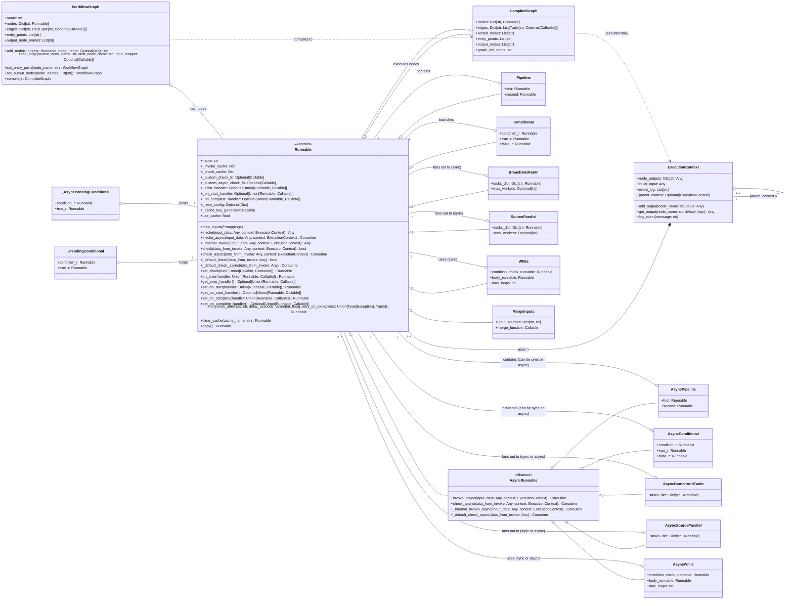

# TaskPipe 工作流框架 API 文档

本文档介绍了基于 `Runnable`/`AsyncRunnable` 和 `WorkflowGraph` 的 Python 工作流框架的核心 API，支持同步和异步执行模式的混合编排。

## 目录结构

```
.
├── taskpipe/
│   ├── __init__.py         # 包初始化，提升常用类
│   ├── runnables.py      # Runnable 基类, 同步实现, ExecutionContext
│   ├── async_runnables.py # AsyncRunnable 基类, 异步组合器
│   └── graph.py          # WorkflowGraph 和 CompiledGraph
├── tests/                  # 测试代码
│   ├── test_runnables.py
│   ├── test_async_runnables.py
│   └── test_graph.py
├── examples/               # 示例代码
│   └── test.py
└── setup.py                # 项目安装配置
```

## 类关系图 (Mermaid)



## 核心 API

### 1. `taskpipe.ExecutionContext` 与 `taskpipe.InMemoryExecutionContext`

`ExecutionContext` 现为一个 `Protocol`（接口），定义了 `add_output`、`get_output`、`log_event` 等核心方法，用于在工作流执行过程中共享状态、事件日志和父子上下文链路。

`InMemoryExecutionContext` 是该协议的默认实现：所有数据保存在内存中，适合本地和嵌入式场景。你可以实现自定义的 `ExecutionContext`（例如 `RedisExecutionContext`、`DatabaseExecutionContext`）以支持持久化和跨进程任务恢复。

**InMemoryExecutionContext 主要属性：**

- `initial_input: Any`: 工作流的初始输入数据。
- `node_outputs: Dict[str, Any]`: 已执行节点的输出集合。
- `event_log: List[str]`: 执行过程中记录的事件（带时间戳，便于调试）。
- `parent_context: Optional[ExecutionContext]`: 可选的父上下文，实现嵌套/子流程。
- `node_status_events: List[Dict[str, Any]]`: 记录 `Runnable` 报告的 start/success/failed 事件；也可以重写/实现 `notify_status(node_name, status, metadata)` 将事件推送到外部系统。

**主要方法：**

- `add_output(node_name, value)`: 写入节点输出。
- `get_output(node_name, default=None)`: 读取节点输出，可回溯父上下文。
- `log_event(message)`: 写入事件日志。

> 可以通过 `taskpipe.NO_INPUT` 表示“沿用 map_inputs/静态常量中声明的输入”，无需再手写上下文解析逻辑。

### 2. `taskpipe.Runnable` (ABC)

所有可执行单元的抽象基类。定义了同步和异步执行的基本接口。

**主要属性:**

- `name: str`: `Runnable` 实例的名称。如果未提供，则基于类名和对象ID自动生成。
- `_invoke_cache` / `_check_cache`: 分别缓存 `invoke` 与 `check` 结果。
- `use_cache: Bool`: 是否启用缓存。
- `_custom_check_fn` / `_custom_async_check_fn`: 自定义同步/异步检查函数。
- `_error_handler` / `_on_start_handler` / `_on_complete_handler`: 生命周期钩子。
- `_retry_config`: 重试设置。
- `_cache_key_generator`: 生成缓存键的函数，默认为 `_default_cache_key_generator`，其默认实现会考虑输入数据和 `map_inputs` 绑定。
- `InputModel` / `OutputModel` / `ConfigModel`: `pydantic.BaseModel` 子类，用于声明输入/输出/配置契约；`InputModel` 与 `OutputModel` 现为必填。
- `_input_bindings`: 通过 `map_inputs` 和静态常量构建的字段级依赖描述。
- `Output`: 属性访问器，可通过 `some_task.Output.field_name` 在上游表达式中引用字段，配合 `map_inputs` 形成显式数据映射。

**`@task` 装饰器**:

`@task` 装饰器可以将普通函数（包括异步函数）转换为 `Runnable` 或 `AsyncRunnable` 实例。装饰器会自动从函数签名推断 `InputModel` 和 `OutputModel`：

- **同步函数**: 装饰后生成同步 `Runnable` 子类，实现 `_internal_invoke` 方法。
- **异步函数**: 装饰后生成 `AsyncRunnable` 子类，实现 `_internal_invoke_async` 方法。
- **类型推断**: 从函数参数的类型提示自动生成 `InputModel`，从返回类型提示自动生成 `OutputModel`。
- **Pydantic 模型支持**: 如果返回类型是 Pydantic `BaseModel`，直接使用该模型作为 `OutputModel`；如果返回类型是字典注解（如 `-> {"field": type}`），则生成对应的模型。
- **单字段自动包装**: 如果函数返回原始值（如 `int`、`str`），会自动包装为单字段模型（如 `{"result": value}`）。

**主要方法:**

- `__init__(self, name: Optional[str] = None, cache_key_generator: Optional[Callable] = None, use_cache: bool = False, config: Optional[Dict[str, Any]] = None)`: 构造函数；当声明 `ConfigModel` 时会自动校验 `config`。
- `invoke(self, input_data: Any = NO_INPUT, context: Optional[ExecutionContext] = None) -> Any`:
    - **同步执行** `Runnable` 的核心公共方法。
    - 管理执行流程：创建或使用 `ExecutionContext`，触发 `notify_status(..., "start")`，调用 `on_start` 钩子，解析输入数据（支持 `InputModel` 验证），检查缓存，执行重试逻辑（内部包含 `_internal_invoke` 调用和 `on_error` 处理器逻辑），最后调用 `on_complete` 钩子并触发 `success/failed` 状态。
- `_internal_invoke(self, input_data: Any, context: ExecutionContext) -> Any`: (抽象方法) **同步**子类必须实现此方法以定义其核心同步逻辑。
- `invoke_async(self, input_data: Any = NO_INPUT, context: Optional[ExecutionContext] = None) -> Coroutine[Any, Any, Any]`:
    - **异步执行** `Runnable` 的核心公共方法。
    - 对于普通的同步 `Runnable`，此默认实现会将其同步的 `invoke()` 方法（包括所有新的钩子逻辑）包装在 `ThreadPoolExecutor` 中运行。
    - `AsyncRunnable` 子类会重写此方法以提供其原生的异步执行逻辑，并应在其实现中集成对异步钩子和异步错误处理器的调用。
- `check(self, data_from_invoke: Any, context: Optional[ExecutionContext] = None) -> bool`:
    - 对 `invoke` (或 `invoke_async`) 的结果进行验证或条件检查。
    - 使用 `_custom_check_fn` (如果已设置)，否则调用 `_default_check`。结果会被缓存。
- `_default_check(self, data_from_invoke: Any) -> bool`: 默认的同步检查逻辑，简单地对 `data_from_invoke` 进行布尔转换。
- `check_async(self, data_from_invoke: Any, context: Optional[ExecutionContext] = None) -> Coroutine[Any, Any, bool]`:
    - 异步检查方法。
    - 如果设置了 `_custom_async_check_fn`，则 `await` 它。
    - 否则，对于同步 `Runnable`，此默认实现会将其同步的 `check()` 方法包装在 `ThreadPoolExecutor` 中运行。
- `_default_check_async(self, data_from_invoke: Any) -> Coroutine[Any, Any, bool]`:
    - `Runnable` 基类中的默认异步检查逻辑是简单地对数据进行布尔转换并返回。
    - `AsyncRunnable` 子类应重写此方法以提供真正的异步检查逻辑。
- `set_check(self, func: Union[Callable[[Any], bool], Callable[[Any], Coroutine[Any, Any, bool]]]) -> 'Runnable'`:
- `map_inputs(self, **mappings) -> 'Runnable'`:
    - 通过 `child.map_inputs(foo=parent.Output.bar, timeout=5)` 显式声明字段级数据传递与静态常量。
    - `Output` 属性会返回 `_OutputFieldRef`，使得 IDE 智能感知字段名称且避免硬编码。
    - 返回新的 `Runnable` 副本（保持不可变语义）。
- **Pydantic 数据契约**：
    - 若声明 `InputModel`，`invoke`/`invoke_async` 会在 `_internal_invoke` 之前自动执行 `InputModel(**payload)` 并将模型实例传入；校验失败会抛出 `ValueError`。
    - 若声明 `OutputModel`，`_internal_invoke` 返回后会执行 `OutputModel.parse_obj(result)`，返回的就是模型实例。
    - `ConfigModel` 允许你定义静态配置 schema，实例化 `Runnable` 时传入 `config=` 字典即可自动校验，方便序列化/反序列化。
    - 允许用户自定义 `check` 方法的逻辑。
    - 如果 `func` 是一个协程函数，它将被设置为 `_custom_async_check_fn`。
    - 如果 `func` 是一个普通的可调用函数，它将被设置为 `_custom_check_fn`。
- `on_error(self, handler: Union['Runnable', Callable[[ExecutionContext, Any, Exception], Any]]) -> 'Runnable'`:
    - 指定一个错误处理器。可以是 `Runnable` 实例或一个可调用函数。
    - 可调用函数签名: `(context: ExecutionContext, input_data: Any, exception: Exception) -> Any`。其返回值将作为任务的结果。
    - `Runnable` 处理器将通过 `invoke(input_data, context)` 调用。
- `get_error_handler(self) -> Optional[Union['Runnable', Callable[[ExecutionContext, Any, Exception], Any]]]`: 返回配置的错误处理器。
- `set_on_start(self, handler: Union['Runnable', Callable[[ExecutionContext, Any], None]]) -> 'Runnable'`:
    - 设置一个在任务开始时调用的处理器。
    - 可调用函数签名: `(context: ExecutionContext, input_data: Any) -> None`。
    - `Runnable` 处理器将通过 `invoke(input_data, context)` 调用。
- `get_on_start_handler(self) -> Optional[Union['Runnable', Callable[[ExecutionContext, Any], None]]]`: 返回配置的 on_start 处理器。
- `set_on_complete(self, handler: Union['Runnable', Callable[[ExecutionContext, Any, Optional[Exception]], None]]) -> 'Runnable'`:
    - 设置一个在任务完成时（无论成功或失败）调用的处理器。
    - 可调用函数签名: `(context: ExecutionContext, result: Any, exception: Optional[Exception]) -> None` (其中 `result` 是任务的最终输出，如果发生异常则可能为 `None` 或 `NO_INPUT`；`exception` 是最终的异常对象，如果成功则为 `None`)。
    - `Runnable` 处理器将通过 `invoke(input_data_to_task, context)` 调用，它可以从上下文中检查最终结果或异常。
- `get_on_complete_handler(self) -> Optional[Union['Runnable', Callable[[ExecutionContext, Any, Optional[Exception]], None]]]`: 返回配置的 on_complete 处理器。
- `retry(self, max_attempts: int = 3, delay_seconds: Union[int, float] = 1, retry_on_exceptions: Union[Type[Exception], Tuple[Type[Exception], ...]] = (Exception,)) -> 'Runnable'`: 配置当前任务的重试逻辑。
- `clear_cache(self, cache_name: str = 'all') -> 'Runnable'`: 清除 `_invoke_cache` 和/或 `_check_cache`。
- `copy(self) -> 'Runnable'`: 创建 `Runnable` 的深拷贝副本，并清除新副本的缓存。
- `__or__(self, other: Union['Runnable', Dict[str, 'Runnable']]) -> 'Runnable'`:
    - 操作符 `|` 的实现。
- `__mod__(self, true_branch: 'Runnable') -> '_PendingConditional'`:
    - 操作符 `%` 的实现，用于条件逻辑的开始。
- `_PendingConditional.__rshift__(self, false_r: 'Runnable') -> 'Conditional'`:
    - 操作符 `>>` 的实现，用于完成条件逻辑的定义。

### 3. `taskpipe.async_runnables.AsyncRunnable` (ABC)

继承自 `taskpipe.Runnable`，是所有原生异步可执行单元的抽象基类。

**核心特性**:

* 其 `invoke_async` 和 `check_async` 方法提供了原生的异步执行和检查逻辑。
* 其操作符重载 (`__or__`, `__ror__`, `__mod__`) 会创建异步感知的组合器（如 `AsyncPipeline`, `AsyncConditional`），这些组合器能够正确处理包含同步或异步 `Runnable` 的混合工作流。

**主要方法 (重写或新增):**

* `invoke_async(self, input_data: Any = NO_INPUT, context: Optional[ExecutionContext] = None) -> Coroutine[Any, Any, Any]`:
  * **原生异步执行** `AsyncRunnable` 的核心公共方法。
  * 管理执行流程：创建或使用 `ExecutionContext`，解析 `map_inputs`/静态常量声明的字段，检查缓存，执行异步重试逻辑，`await self._internal_invoke_async(...)`，处理错误 (错误处理器也通过 `invoke_async` 调用)，存储缓存和上下文输出。
  * 这是在异步代码中执行 `AsyncRunnable` 的 **推荐方式**。
* `_internal_invoke_async(self, input_data: Any, context: ExecutionContext) -> Coroutine[Any, Any, Any]`: (抽象方法) **异步**子类必须实现此方法以定义其核心异步逻辑。
* `check_async(self, data_from_invoke: Any, context: Optional[ExecutionContext] = None) -> Coroutine[Any, Any, bool]`:
  * 原生异步检查方法。
  * 使用 `_custom_async_check_fn` (如果已设置)，否则 `await self._default_check_async(...)`。结果会被缓存。
* `_default_check_async(self, data_from_invoke: Any) -> Coroutine[Any, Any, bool]`: (抽象方法或提供默认实现) 默认的原生异步检查逻辑。简单实现可以是 `async def _default_check_async(self, data_from_invoke: Any) -> bool: return bool(data_from_invoke)`。
* `_internal_invoke(self, input_data: Any, context: ExecutionContext) -> Any`:
  * (已在 `AsyncRunnable` 中实现) 这是为了让 `AsyncRunnable` 实例也能响应同步的 `Runnable.invoke()` 调用。
  * 它内部实现通常是：
    ```python
    try:
        loop = asyncio.get_running_loop()
        if loop.is_running():
            logger.error(f"FATAL: AsyncRunnable '{self.name}'._internal_invoke called synchronously from an async context. This is not supported correctly. Use invoke_async.")
            raise RuntimeError(f"AsyncRunnable '{self.name}' cannot be invoked synchronously using _internal_invoke from an already running event loop.")
    except RuntimeError: # No running event loop
         pass
    return asyncio.run(self._internal_invoke_async(input_data, context))
    ```
  * **警告**：如果在已运行的 `asyncio` 事件循环中调用此方法 (即 `AsyncRunnable` 实例的同步 `invoke()` 方法)，会导致 `RuntimeError`。

**操作符重载 (`__or__`, `__ror__`, `__mod__`)**:

* 当 `AsyncRunnable` 参与操作符运算时，会确保生成的组合器是异步版本的（例如 `AsyncPipeline`, `_AsyncPendingConditional` -> `AsyncConditional`）。
* `__ror__` (右操作符，例如 `sync_runnable | async_runnable`) 确保组合结果也是异步的。

### 4. `taskpipe` 中的具体 `Runnable` 实现

#### 同步实现 (`taskpipe.runnables`)

* **`@task` 装饰器**: 将普通函数（包括异步函数）包装成 `Runnable` 或 `AsyncRunnable`，自动从函数签名推断 `InputModel`/`OutputModel`。对于异步函数，会自动生成 `AsyncRunnable` 子类。
  * 使用方式: `@task` 装饰器直接应用于函数定义，支持类型提示和 Pydantic 模型。
* **`Pipeline(Runnable)`**: 按顺序同步执行两个 `Runnable`。
  * `__init__(self, first: Runnable, second: Runnable, name: Optional[str] = None, **kwargs)`
* **`Conditional(Runnable)`**: 根据同步条件执行两个分支之一。在展开为图时会自动插入 `_CheckAdapterRunnable` 和 `Router` 节点，实现显式的条件判断和数据透传。
  * `__init__(self, condition_r: Runnable, true_r: Runnable, false_r: Runnable, name: Optional[str] = None, **kwargs)`
* **`BranchAndFanIn(Runnable)`**: 将单个输入扇出到多个并行同步任务（使用 `ThreadPoolExecutor`），并聚合结果。
  * `__init__(self, tasks_dict: Dict[str, Runnable], name: Optional[str] = None, max_workers: Optional[int] = None, **kwargs)`
* **`SourceParallel(Runnable)`**: 并行同步执行多个任务链（使用 `ThreadPoolExecutor`），每个链接收相同的初始输入（或从上下文的 `initial_input` 获取）。
  * `__init__(self, tasks_dict: Dict[str, Runnable], name: Optional[str] = None, max_workers: Optional[int] = None, **kwargs)`
* **`While(Runnable)`**: 根据同步条件重复执行一个同步 `Runnable` 主体。
  * `__init__(self, condition_check_runnable: Runnable, body_runnable: Runnable, max_loops: int = 100, name: Optional[str] = None, **kwargs)`
* **`MergeInputs(Runnable)`**: 从上下文收集多个输入，并传递给一个同步合并函数。
  * `__init__(self, input_sources: Dict[str, str], merge_function: Callable[..., Any], name: Optional[str] = None, **kwargs)`

#### 异步实现 (`taskpipe.async_runnables`)

这些组合器被设计为可以处理其子任务是同步 `Runnable` 还是异步 `AsyncRunnable` 的情况。它们总是通过 `invoke_async` (或 `check_async`) 来调用子任务。

* **`AsyncPipeline(AsyncRunnable)`**:
  * 按顺序异步执行两个 `Runnable`（可以是同步或异步）。
  * 如果子任务是同步 `Runnable`，会 `await task.invoke_async(input, context)` (即在线程池中运行其同步 `invoke`)。
  * 如果子任务是 `AsyncRunnable`，会直接 `await task.invoke_async(input, context)`。
* **`AsyncConditional(AsyncRunnable)`**:
  * 条件 `Runnable` (condition\_r) 通过 `await condition_r.check_async(...)` 进行检查。
  * 根据结果，对真分支或假分支的 `Runnable` (true\_r 或 false\_r) 调用 `await branch.invoke_async(...)`。
  * 在展开为图时会自动插入 `_AsyncCheckAdapterRunnable` 和 `Router` 节点，实现显式的条件判断和数据透传。
* **`AsyncBranchAndFanIn(AsyncRunnable)`**:
  * 将单个输入异步扇出到 `tasks_dict` 中的多个并行任务。
  * 对每个任务调用 `task.invoke_async(input, context)`，并使用 `asyncio.gather(*coros, return_exceptions=True)` 来并发执行和收集结果。
  * 如果任何任务抛出异常，会收集所有异常并重新抛出第一个。
* **`AsyncSourceParallel(AsyncRunnable)`**:
  * 并行异步执行 `tasks_dict` 中的多个任务链，每个链接收相同的初始输入（或从上下文的 `initial_input` 获取）。
  * 对每个任务调用 `task.invoke_async(input, context)`，并使用 `asyncio.gather(*coros, return_exceptions=True)`。
  * 处理方式类似于 `AsyncBranchAndFanIn`。
* **`AsyncWhile(AsyncRunnable)`**:
  * `condition_check_runnable` 通过 `await condition_check_runnable.check_async(...)` 进行检查。
  * 如果条件为真，`body_runnable` 通过 `await body_runnable.invoke_async(...)` 执行。
  * 重复直到条件为假或达到 `max_loops`。
* **`AgentLoop(AsyncRunnable)`**:
  * 封装 ReAct/Agent 循环：`generator` 负责决定下一步行动。
  * 调用 `generator.invoke_async()` 得到结果：
    * 如果结果是 `Runnable`，则立即执行该 `Runnable` 并将其输出作为下一轮 `generator` 的输入。
    * 如果结果是普通值，则循环结束并返回该值。
  * 可通过 `max_iterations` 防止无限循环。

### 5. `taskpipe.graph.WorkflowGraph`

用于以声明方式构建工作流图的构建器类。节点可以是同步 `Runnable` 或异步 `AsyncRunnable`。

**主要属性:**

* `name: str`: 图的名称。
* `nodes: Dict[str, Runnable]`: 图中节点的字典 (存储的是 `Runnable` 的副本)。
* `edges: Dict[str, List[EdgeDefinition]]`: 图中边的字典，`EdgeDefinition` 包含 `data_mapping`、`static_inputs`、`branch` 等元数据。
* `entry_points: List[str]`: 用户指定的图入口节点名称列表。如果未指定，则自动推断为入度为0的节点。
* `output_node_names: List[str]`: 用户指定的图输出节点名称列表。如果未指定，则自动推断为出度为0的节点。

**主要方法:**

* `__init__(self, name: Optional[str] = None)`: 构造函数。
* `add_node(self, runnable: Runnable, node_name: Optional[str] = None) -> str`: 向图中添加一个节点。`runnable` 会被复制 (`runnable.copy()`) 后存储。节点名称必须唯一。
* `add_edge(self, source_node_name: str, dest_node_name: str, data_mapping: Optional[Dict[str, str]] = None, static_inputs: Optional[Dict[str, Any]] = None, branch: Optional[str] = None)`: 添加一条从源节点到目标节点的边。`data_mapping` 描述字段拷贝关系，`static_inputs` 记录常量注入，`branch` 用于 Router 控制流。
* `set_entry_point(self, node_name: str) -> 'WorkflowGraph'`: 设置图的一个入口节点。
* `set_output_nodes(self, node_names: List[str]) -> 'WorkflowGraph'`: 设置图的输出节点列表。
* `compile(self, enable_gc: bool = False) -> 'CompiledGraph'`: 分析图结构（进行拓扑排序以检测循环并确定执行顺序），并返回一个可执行的 `CompiledGraph` 实例。`enable_gc` 参数控制是否启用内存垃圾回收（清理不再被下游节点使用的中间数据）。
* `to_json(self) -> Dict[str, Any]`: 将当前图序列化，便于持久化或下发至低代码平台（暂不序列化复杂的 `input_mapper`）。
* `@classmethod from_json(cls, json_data: Dict[str, Any], registry: Union[Dict[str, Union[Runnable, Callable[[], Runnable]]], RunnableRegistry]) -> WorkflowGraph`: 根据 JSON + 注册表重建工作流，可以传入 taskpipe 自带的 `RunnableRegistry`。

同时，任何 `Runnable`/`AsyncRunnable` 都可以调用 `.to_graph(graph_name=None)`。该方法会递归地“展开”由 `|`、`%`、`>>` 等操作符构建的动态结构，生成一个等价的 `WorkflowGraph`，从而实现代码模式与声明式模式之间的互操作。请参考 `examples/example.py`：该示例将图保存为 `examples/numbers_workflow.json`，并展示如何通过 `WorkflowGraph.from_json(...)` + `registry` 反序列化回可执行的图。

### 6. `taskpipe.graph.CompiledGraph(Runnable)`

`WorkflowGraph` 的可运行表示，它本身也是一个 `Runnable`。

**主要属性 (从 `WorkflowGraph` 编译而来):**

* 继承自 `Runnable` (因此拥有 `name`, `_invoke_cache` 等属性)。
* `nodes: Dict[str, Runnable]`: 编译时图中所有节点的映射。
* `edges: Dict[str, List[Tuple[str, Optional[Callable]]]]`: 编译时边的映射。
* `sorted_nodes: List[str]`: 按拓扑顺序排序的节点名称列表，用于确定执行顺序。
* `execution_stages: List[List[str]]`: 由拓扑排序推导出的阶段划分，同一阶段内的节点互不依赖，可在异步执行时并发运行。
* `entry_points: List[str]`: 图的实际入口点。
* `output_nodes: List[str]`: 图的实际输出节点。
* `graph_def_name: str`: 从中编译此图的 `WorkflowGraph` 的名称。
* `enable_gc: bool`: 是否启用内存垃圾回收，清理不再被下游节点使用的中间数据。

**执行**:

* `_internal_invoke(self, input_data: Any, context: ExecutionContext) -> Any`:
  * **同步执行**整个图。
  * 创建一个内部的 `ExecutionContext` (其父级是传入的 `context`)。
  * 按 `execution_stages` 的顺序遍历节点（同步模式下仍是顺序执行）。
  * 对每个节点：
    * 调用 `_prepare_node_input` 来根据 `data_mapping`/`static_inputs` 拼装下一节点的输入。
    * 调用节点的同步 `node.invoke(node_input, internal_graph_context)`。
  * 收集 `output_nodes` 的结果并返回。
  * **警告**：如果图中包含 `AsyncRunnable` 节点，并且 `CompiledGraph.invoke()` 是在一个已运行的 `asyncio` 事件循环中被调用的，那么这些 `AsyncRunnable` 节点的 `invoke()` (内部使用 `asyncio.run()`) 会导致 `RuntimeError`。
* `_internal_invoke_async(self, input_data: Any, context: ExecutionContext) -> Coroutine[Any, Any, Any]`:
  * **异步执行**整个图的核心逻辑。
  * 创建一个内部的 `ExecutionContext`。
  * 按 `execution_stages` 的顺序遍历节点。
  * 对每个阶段：
    * 准备每个节点的输入。
    * 使用 `asyncio.gather` 并发执行所有节点的 `invoke_async`。
      * 如果节点是同步 `Runnable`，其 `invoke_async` 会在线程池中运行其同步 `invoke`。
      * 如果节点是 `AsyncRunnable`，其原生的 `invoke_async` 会被执行。
  * 收集 `output_nodes` 的结果并返回。
* `invoke_async(self, input_data: Any = NO_INPUT, context: Optional[ExecutionContext] = None) -> Coroutine[Any, Any, Any]`:
  * `CompiledGraph` 作为 `Runnable` (或应视为 `AsyncRunnable` 行为的实体) 的公共异步接口。
  * 它会处理顶层图执行的上下文创建，并调用 `self._internal_invoke_async(...)`。
  * 这是在异步代码中执行包含混合任务类型的图的**推荐方式**。
* `clear_cache(self, cache_name: str = 'all') -> 'CompiledGraph'`:
  * 清除此编译图自身的缓存，并递归调用其所有内部节点的 `clear_cache` 方法。

## 工作流执行的调用约定

为确保正确执行并避免 `RuntimeError`（尤其是在处理异步组件时）：

1. **从同步上下文调用**：

   * 如果你的主程序或调用上下文是**同步**的，你可以对任何 `Runnable`（包括 `CompiledGraph` 或由操作符组成的 `Pipeline`）使用其**同步的 `.invoke()`** 方法。
   * 如果被调用的 `Runnable` 是一个 `AsyncRunnable` (或包含异步组件的 `AsyncPipeline`/`CompiledGraph`)，其 `.invoke()` 方法内部会使用 `asyncio.run()` 来启动一个新的事件循环执行异步逻辑。这在纯同步环境中是安全的。
2. **从异步上下文调用** (`async def` 函数内)：

   * 你应该对任何 `Runnable` (特别是 `AsyncRunnable` 的实例、`AsyncPipeline`、`AsyncConditional` 或包含 `AsyncRunnable` 节点的 `CompiledGraph`) 使用其**异步的 `await .invoke_async()`** 方法。
   * 这会确保异步操作在当前正在运行的事件循环中正确调度和执行。
   * 对于同步 `Runnable`，其 `invoke_async()` 方法会将其同步逻辑包装到线程池中执行，从而避免阻塞当前事件循环。
   * **强烈不推荐**在异步上下文中对 `AsyncRunnable` 或包含异步组件的组合器使用同步的 `.invoke()` 方法，因为这会导致 `asyncio.run()` 在已运行的循环中被调用，从而引发 `RuntimeError`。

**简而言之**：在 `async def` 中，总是用 `await ...invoke_async()`。在普通 `def` 中，用 `.invoke()`。

## `taskpipe.registry.RunnableRegistry`

`RunnableRegistry` 是一个可选的辅助类，适合在应用层集中管理可用的 `Runnable`：

- `register(name, factory_or_cls)`: 注册 `Runnable` 子类、实例或返回 `Runnable` 的工厂。
- `register_class(cls, name=None)`: 语法糖/装饰器。
- `get(name) -> Runnable`: 返回一个新的实例，可直接传给 `WorkflowGraph.add_node` / `.from_json(...)`。

`WorkflowGraph.from_json` 可直接接收 `RunnableRegistry`，避免在多个地方维护手写 `dict`。

## TaskPipe 的适用场景与边界

TaskPipe 主要设计用于编排具有明确定义的阶段、输入和输出的**数据处理流水线和任务序列**。它非常适合以下场景：

* ETL (提取、转换、加载) 过程。
* 复杂的数据分析和报告生成。
* 机器学习模型的训练和推理流水线。
* 批处理任务。
* 任何可以分解为一系列可组合步骤的操作，无论是同步的、异步的，还是两者混合的。

**边界考虑**：

对于需要**复杂实时外部事件监听**（例如，持续的UI交互、键盘/鼠标事件驱动的长时间运行状态，如实时视频录制控制）的场景，TaskPipe 本身不直接提供事件监听的基础设施。这些通常需要专门的事件处理循环和状态机。

在这种情况下，推荐的做法是：

1. 使用专门的库（如 `pynput`, `keyboard` 用于键盘事件，GUI 框架如 `PyQt`, `Tkinter`，或者网络服务器框架如 `FastAPI`, `Flask`）来处理外部事件的监听和初步响应。这些模块通常有自己的事件循环或线程模型。
2. 当这些外部事件指示一个明确的、可以由 TaskPipe 处理的数据处理阶段开始时（例如，视频录制完成并保存了文件，或者接收到了一个API请求），**由该外部模块触发一个 TaskPipe 工作流**。此时，可以将必要的上下文（如文件路径、请求数据）作为输入传递给 TaskPipe 工作流的 `invoke()` 或 `invoke_async()` 方法。
3. TaskPipe 工作流随后负责后续的所有结构化处理步骤（如校验、转换、分析、存储、通知等）。

这种关注点分离的方法可以保持 TaskPipe 框架的核心功能（任务编排和数据流管理）简洁高效，同时使其能够与事件驱动的系统和应用场景良好集成。

## 快速入门 (Quick Start)

本节通过一个混合了同步和异步任务的流水线示例，展示如何使用本框架。

```python
import asyncio
from taskpipe import (
    InMemoryExecutionContext,
    Runnable,
    AsyncRunnable,
    task,
    NO_INPUT
)

# 1. 定义任务 (可以是同步或异步)

# 使用 @task 装饰器定义同步任务
@task
def my_sync_task(input_data: str) -> str:
    if input_data is NO_INPUT:
        processed_input = "default_sync_input"
    else:
        processed_input = input_data
    result = f"sync_processed_{processed_input}"
    print(f"MySyncTask: {processed_input} -> {result}")
    return result

# 使用 @task 装饰器定义异步任务（自动生成 AsyncRunnable）
@task
async def my_async_process(input_data: str) -> str:
    if input_data is NO_INPUT:
        processed_input = "default_async_input"
    else:
        processed_input = input_data
    print(f"MyAsyncProcess: Starting async processing for {processed_input}...")
    await asyncio.sleep(0.02) # 模拟异步I/O
    result = f"async_finally_processed_{processed_input}"
    print(f"MyAsyncProcess: ...finished async processing for {processed_input} -> {result}")
    return result

# 也可以使用传统继承方式定义异步任务
class MyAsyncProcess(AsyncRunnable):
    async def _internal_invoke_async(self, input_data: Any, context: ExecutionContext) -> Any:
        if input_data is NO_INPUT:
            processed_input = "default_async_input"
        else:
            processed_input = input_data
        print(f"MyAsyncProcess: Starting async processing for {processed_input}...")
        await asyncio.sleep(0.02)
        result = f"async_finally_processed_{processed_input}"
        print(f"MyAsyncProcess: ...finished async processing for {processed_input} -> {result}")
        return result

@task
def my_final_sync_task(input_data: str) -> str:
    result = f"final_sync_touch_on_{input_data}"
    print(f"MyFinalSyncTask: {input_data} -> {result}")
    return result

# 2. 创建 Runnable 实例
sync_task1 = my_sync_task()
async_task = my_async_process()  # 或 MyAsyncProcess(name="MainAsyncWork")
sync_task2 = my_final_sync_task()

# 3. 构建混合工作流: Sync | Async | Sync
# 由于 async_task 是 AsyncRunnable，操作符重载会确保 workflow 是 AsyncPipeline
workflow = sync_task1 | async_task | sync_task2

# 4. 执行 (在异步上下文中)
async def main():
    print(f"Workflow is of type: {type(workflow)}") # 应该是 AsyncPipeline

    ctx = InMemoryExecutionContext()
    initial_data = "start_data_001"

    print(f"\nExecuting workflow for '{initial_data}' using 'await workflow.invoke_async()':")
    # 在异步上下文 (main) 中调用，使用 await invoke_async
    final_result = await workflow.invoke_async(initial_data, ctx)
    print(f"Final Result from async execution: {final_result}")

    print("\nEvent Log:")
    for event in ctx.event_log:
        print(event)


if __name__ == "__main__":
    asyncio.run(main())

```

### 如何创建自定义 Runnable：

**可以参考 `examples/example.py` 中的示例，或者参考以下步骤：**

**1. 继承 `Runnable` 或 `AsyncRunnable`。**

**2. 实现 `_internal_invoke` 方法（对于同步 `Runnable`）或 `_internal_invoke_async` 方法（对于异步 `AsyncRunnable`）。**

**3. （可选）自定义 `check` 方法或 `_default_check` 方法，以提供自定义的检查逻辑。**

**4. （可选）通过 `map_inputs` 声明字段映射，以便在代码与 GUI 之间共享数据契约。**

**5. （可选）自定义 `cache_key_generator`，以提供自定义的缓存键生成逻辑。**

**6. （可选）使用 `on_error` 方法指定错误处理器。**

**7. （可选）使用 `retry` 方法配置重试逻辑。**
